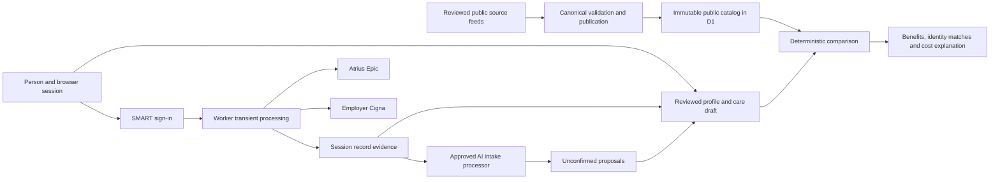

# Production implementation and qualification plan

## Agreed product

Plan Shepherd is a national 2026 web application for a single coverage applicant comparing ACA Marketplace, short-term medical and Medicare Advantage plans. It collects structured information with optional AI intake assistance, imports the person's Atrius/Epic and employer-sponsored Cigna history, lets the person review an anticipated-care draft, and compares plan benefits, preferred providers, medications and costs.

Eligibility is preliminary. The application does not need an AI ranking or a best-plan score. Patient records, chat, preferences, drafts and tokens are session-only. Public catalog data is persistent and versioned. The two patient connectors remain the agreed connectors; broader integration expansion is not part of this implementation plan.

Production is the target. The repository now contains the application and executable boundaries described below. It does **not** contain verified nationwide production feeds, live connector registrations, an approved production AI project, an actual deployed catalog database or evidence of live production qualification. Some source-specific catalog and calculation adapters still require implementation against acquired sources. Filling an environment file does not supply those facts or adapters.

## Implemented architecture

| Layer | Implementation | Responsibility |
| --- | --- | --- |
| Browser | React, TypeScript, Vite; `src/client` | Structured intake, records and draft review, source conditions, plan selection/comparison, optional assistant, session clearing |
| Worker API | Hono, Zod; `src/server` | Request validation, configured connector routing, source-backed catalog access, deterministic comparisons, controlled AI requests |
| Patient transport | `src/connectors/transport.ts`, `receipt.ts`, `references.ts` | SMART authorization-code flow with S256 PKCE, patient context, bounded reads, signed token/patient/connector/expiry binding and authorized-reference capabilities |
| FHIR adaptation | `src/connectors/fhir.ts` | Evidence-preserving normalization, exact product identity, medication units, patient metadata, missing/conflicting/partial-data reporting |
| Domain | `src/domain` | Preliminary eligibility, history reconciliation, forecast draft, exact identity matching and deterministic cost replay |
| Public catalog | `src/catalog`, D1 migration | Typed immutable releases, geography/rates, indexed provider/drug/price components and visible source-gap declarations |
| Acquisition | `scripts/catalog`, `scripts/import-catalog.ts` | Genuine CMS ACA CSV/ZIP conversion, canonical validation, partitioned imports and atomic release publication |
| Local/release tooling | `scripts/env.ts`, `prepare-env.ts`, deployment/verification scripts | Private environment handling, explicit provisioning/deployment configuration and release qualification checks |

Node 24 is the repository's declared local/tooling runtime. Cloudflare Workers serves the API and built assets. The checked-in configuration disables Worker observability logs/traces and has an unprovisioned D1 placeholder; it is not a production deployment.

The diagram describes permitted data flow. Patient records do not flow into the public catalog database. No background patient profile, longitudinal patient database, patient analytics pipeline or enrollment transaction is implemented.

## Trust and session boundaries

The browser holds the active profile, records, tokens, proposals and results in application memory. Clearing the session aborts registered requests, invalidates the generation used by asynchronous work and drops application state. Page lifecycle handling and inactivity/session limits are implemented in `src/client/privacy.ts`. This is application-state disposal, not a claim of browser-process memory zeroization or a guarantee about upstream providers' systems.

The Worker processes patient requests transiently. Patient authorization receipts bind a connector, patient ID, token hash and expiry using an application signing secret. They do not create a persistent patient-session database. Resource ownership, endpoint allowlists, bounded pages, timeouts and error sanitization are enforced outside the AI model. Referenced clinical-support records must be authorized by returned records, not arbitrary URLs entered by a user or generated by AI.

Public catalog releases contain provenance and plan/reference facts only. Published rows are immutable; a single active-release pointer exposes a complete validated release. A session pins its selected release rather than mixing catalog versions midway through a comparison. The publication path preserves older releases for existing sessions and rollback.

Infrastructure service scope, access logs, callback handling, provider authorization, AI processing and retention settings must be qualified against the actual contracts and deployed configuration. Boolean approval settings and automated checks document/enforce the application's boundary; they are not compliance certification.

## AI responsibilities implemented

`src/server/assistant.ts` uses a constrained structured response schema. The model can select an approved help topic and propose provider, medication or explicitly stated anticipated-care facts. The application renders approved help text instead of unrestricted model-generated plan or medical advice.

Proposals must cite known source/chat evidence. Extracted names, locations, strengths and forms are checked against the cited text. An anticipated-care proposal needs an explicit user-supplied date and quantity; the assistant does not extrapolate historical utilization or do arithmetic to produce a future schedule. Proposals remain separate until reviewed.

The model has no executable tool access and cannot modify confirmed inputs, obtain additional patient records, set prices, determine eligibility, query model memory for plan facts, calculate costs, rank plans or suggest a diagnosis, specialist, treatment or medication substitute. No unstructured model explanation can overwrite rendered coverage or numeric comparison results. Forms and deterministic comparisons remain available when AI is disabled or unavailable.

The request adapter sets `store: false` and disables background mode. The actual AI project/model and its approved retention configuration still require external verification; those request parameters alone do not establish Zero Data Retention.

## What is implemented versus what still needs qualification or implementation

| Area | Implemented now | Remaining production work |
| --- | --- | --- |
| Intake and comparison | Working form/session/review flow and deterministic comparison path | Validate usability and accessibility with representative single-applicant workflows and imported records |
| Eligibility | Preliminary guidance, missing-fact reasons, sources and employer/tax-household context | Complete source/version-specific eligibility and assistance adapters before making those additional determinations; assistance amounts currently remain uncalculated |
| Costs | Elementary benefit rules, separate/shared accumulators, payment caps, explicit conditions, source-configured drug phases, per-candidate manual additional Medicare premium scenarios and honest incomplete results | Encode and independently validate every materially different published benefit design; unresolved split-fill, compound, per-day or other unsupported terms need actual adapters. Medicare premiums, IRMAA, assistance and giveback amounts are not calculated automatically |
| Atrius/Epic | Configurable SMART transport and FHIR normalization | Approved production registration, consent/scopes, callback behavior, actual resource/date/paging/reference behavior and a successful qualified live import |
| Employer Cigna | Same transport/normalization boundary | Confirm this person's employer-plan API entitlement and approved endpoint; register and qualify the actual live integration |
| ACA source acquisition | Streaming CMS CSV/ZIP converter and strict canonical importer | Acquire actual 2026 files, review their dictionary/profile mappings, enrich issuer/network/formulary/price data and resolve all coverage gaps, including state-based sources |
| Medicare Advantage data | Canonical schema/import/storage and configurable calculation structures | Implement source-specific PBP/formulary/network/price mappings against acquired official or licensed feeds; a plan list alone is insufficient |
| Short-term data | Canonical schema/import/storage and condition/payment-cap support | Acquire permitted issuer/partner feeds and implement their exact product, geography, underwriting, term, benefit and price mappings |
| National coverage | Explicit per-state/family coverage status, provenance and production checks | Verify every state/family pair as available with complete reviewed evidence or genuinely not offered; absence of data remains `source_gap` |
| Deployment | Environment template, Cloudflare configuration, migration/import/release tooling | Supply real credentials and approved service configuration, provision resources, publish verified public data, complete independent qualification, then deploy |

The source pipeline deliberately does not create demonstration plans that could be mistaken for genuine coverage. CMS ACA conversion currently emits unverified/source-gap output until source completeness and interpretation are reviewed. This is an explicit remaining qualification task, not an automatic upgrade performed by setting a flag.

## Completion sequence

### 1. Establish the reviewed application baseline

Run type checking, the repository test suite and the production build. Verify the local application with the catalog unavailable, connectors disabled, AI disabled and fully manual inputs. Confirm source gaps and unknown costs remain visible. Review [CALCULATIONS.md](CALCULATIONS.md) against executable domain fixtures.

Deliverable: a reproducible application build with documented known calculation boundaries and no embedded patient credentials or synthetic production plan assertions.

### 2. Acquire and implement production source contracts

For each plan family, obtain exact data rights, source files/endpoints, schemas, update behavior and effective-date semantics. Use `scripts/catalog/README.md` and its executable schemas for canonical input and CMS conversion. Add source-specific MA and short-term adapters against the acquired contracts, rather than assuming a URL or credential establishes compatibility.

Preserve plan variants and source-vintage geography. Join rates only through published age/tobacco/geography/date rules. Add networks with location specificity, formularies with product identity and conditions, and prices with service/provider/medication/quantity basis. Complete source declarations for all 50 states and DC and the three agreed families. A not-offered assertion needs source evidence; a missing feed is a gap.

Deliverable: a validated, immutable public release with review evidence, source checksums where available, meaningful completeness declarations and no unresolved source semantics represented as known facts.

### 3. Close benefit and calculation adapter gaps

Build an inventory of benefit rule patterns in the actual feeds. For each pattern, either map it exactly to the implemented primitives or add a source-specific adapter and independent expected-result fixtures. Do this for compound/per-day charges, limits, medical versus pharmacy drug handling, Part D phases/assistance, short-term exclusions and policy/payment caps as encountered.

Keep prices and expected utilization separate. Validate medication fill versus dispensed-unit pricing and supply duration. Confirm that plan-specific eligibility variants are not automatically unlocked by an unverified user assumption. Source-backed preliminary eligibility/assistance functionality may be extended deterministically; AI remains outside those decisions.

Deliverable: an independently reviewed rule pack covering the advertised production comparisons. Unsupported designs must remain explicitly incomplete until their adapters are complete.

### 4. Qualify the two live patient imports

Use the approved Atrius/Epic and employer Cigna registrations. Verify authorization denial, patient switching, receipt expiry, insufficient/excess scopes, resource ownership, paging, partial responses and date filtering. Resolve approved Practitioner/PractitionerRole/Location/Medication references and confirm that both imports refer to the intended person before merging them.

Reconcile representative encounter/claim overlap, adjustments, reversals, facility/professional bills, medication orders, actual fills and supply quantities. Test no-data responses and unavailable resources. Confirm the imported record window, completeness indicators and editable anticipated-care draft match the actual source records. Do not convert a successful OAuth response into a claim of complete clinical history.

Deliverable: repeatable, qualified live imports for the agreed integrations with documented resource/profile behavior and failure handling.

### 5. Configure the approved runtime and AI processing

Start from `.env.example`. Keep real values in the private environment file chosen by the operator; never place them in browser `VITE_` variables, committed source or a public catalog. The environment preparation tooling creates private local runtime bindings; it does not provision production services or prove contract scope.

Configure the Worker origin, actual public D1 database, signing key, connector registrations and approved AI project/model. Verify the infrastructure and AI service scope, retention settings, callback handling, logging and secret access against the deployed service arrangement. Only then set the corresponding processing-approval configuration.

Deliverable: a concrete deployable configuration and documented evidence supporting each processing and retention assertion.

### 6. Qualify the release and deploy

Complete the production-readiness record using `scripts/verify-production.ts`'s schema. It records live integration checks, infrastructure/AI retention reviews, independent calculation review, load-test results, incident/rollback review and every national state/family coverage assertion. The deployment tooling also compares the approved release ID and coverage declarations with the actual catalog database before release.

Run the build, full relevant tests and the deployment dry-run against the exact artifacts/configuration to be released. Exercise catalog publication interruption and rollback, dependency failures, rate limits, session clearing during active work, and source version pinning. Evaluate representative national catalog volumes and request patterns; request limits and database capacity must be measured against the acquired data rather than assumed sufficient.

After qualification and authorized deployment, verify the live origin, current catalog release, configured connectors, AI behavior and session/retention controls. Record the tested artifact and release IDs without retaining patient records.

Deliverable: an actually deployed and independently qualified production release. Passing an environment checker alone is not this deliverable.

## Ongoing operations

Publish new immutable catalog releases when authoritative sources change. Review effective dates and source deltas before activating them; preserve rollback. Add regression cases when a source dictionary, issuer design or failure mode changes. Repeat relevant live qualification after material connector, AI, infrastructure or benefit-engine changes.

Operate with public-data monitoring and approved operational metadata that does not retain patient facts, chat, tokens or clinical source excerpts. Maintain incident and rollback procedures, dependency update review and clearly assigned ownership for data publication, rule review and live integration qualification. National completeness and current source accuracy remain operational responsibilities throughout the 2026 release.
